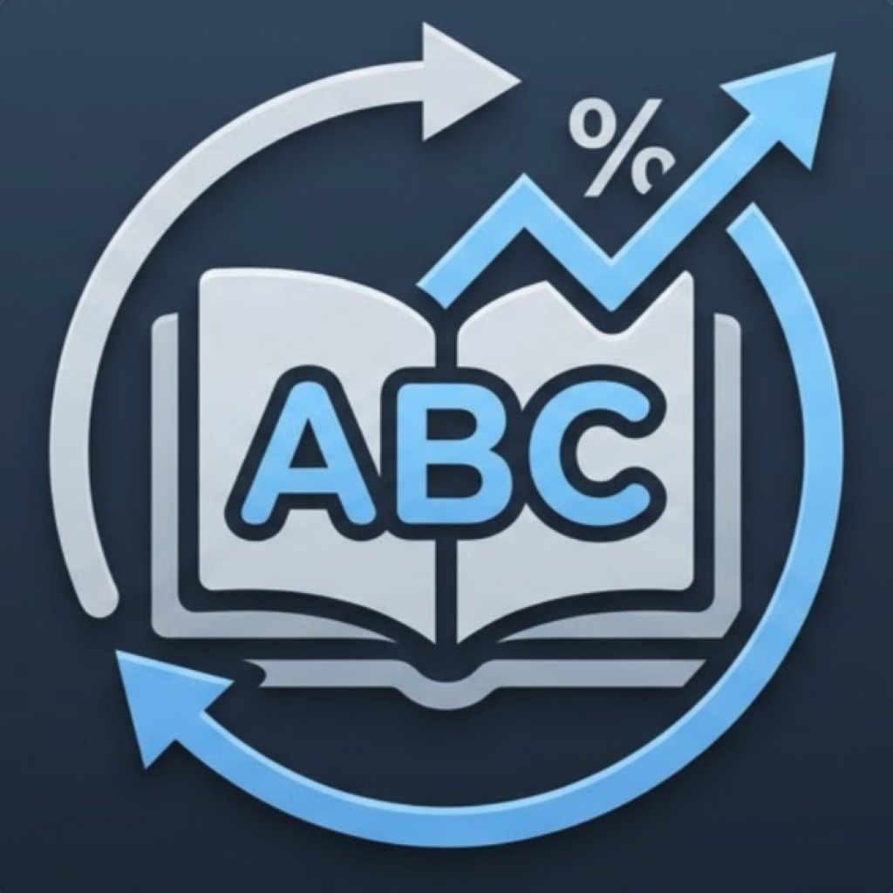

<div align="center">



# SRS Vocab

### 基於 SM-2 間隔重複演算法之跨平台英文單字學習系統

[](../../releases)
[](https://www.python.org)
[](https://flet.dev)

*雲林科技大學 資訊管理系 · 114-2 學年度 · 演算法期末專題*
*作者：張哲維 · B11223020*

</div>

---

## 📖 專案簡介

**SRS Vocab** 是一套以間隔重複演算法 (Spaced Repetition) 為核心之英文單字學習系統，可於 macOS、Windows、Android 三平台執行。整合三項核心演算法：

| 演算法 | 職責 | 複雜度 |
|--------|------|--------|
| **SM-2** (SuperMemo 2) | 記憶排程 | O(1) |
| **Trie** (字典樹) | 即時前綴搜尋 (6,122 字) | O(L+k) |
| **分類池隨機抽樣** | MCQ 題目生成 | O(P), P=20 |

## 🌿 Branch 結構

本 repo 以 **branch 分離三平台版本**：

| Branch | 平台 | 打包方式 |
|--------|------|----------|
| `main` | 說明文件 + 共用資源 | — |
| `macos` | macOS 版本 | `.app` (Flet build) |
| `windows` | Windows 版本 | `.exe` (Flet build) |
| `android` | Android 版本 | `.apk` (Flet build APK) |

切換 branch：`git checkout macos`

編譯後的二進位檔請至 [Releases](../../releases) 頁面下載。

## 🧩 核心技術棧

- **語言**：Python 3.11
- **UI 框架**：Flet 0.83（基於 Flutter 的 Python UI）
- **資料庫**：SQLite 3（WAL 模式）
- **圖表**：matplotlib
- **PDF 解析**：PyMuPDF (fitz)
- **TTS**：macOS `say` / Windows PowerShell `System.Speech`

## 📊 效能量測

本專案附有兩支 benchmark 腳本（見 `benchmarks/` 資料夾）：

- `benchmark_standalone.py` — 獨立版，不依賴 backend，用於建立基準
- `benchmark_real.py` — 真實版，使用 `backend.py` + `srs_vocab.db`

### 主要結果

| 指標 | 模擬版 | 真實版 |
|------|--------|--------|
| Trie 建構 (6,122 字) | 8.9 ms | 10.0 ms |
| Trie vs 線性 (L=5) | **347×** | **28.5×** |
| SM-2 單次更新 | 0.21 µs | 0.83 µs |
| MCQ 生成 | 11.87 µs | 1.79 ms |

詳細結果、複雜度分析、Fitness 實驗請見期末書面報告。

## 🚀 執行方式

```bash
# 1. clone 並切換到目標平台
git clone git@github.com:WENOTA9/srs-vocab.git
cd srs-vocab
git checkout macos        # 或 windows / android

# 2. 安裝依賴
pip install -r requirements.txt

# 3. 執行
python main.py
```

## 📁 專案結構（各平台 branch 內）

```
.
├── main.py              # Flet UI
├── backend.py           # SM-2 / Trie / DB / MCQ / Chart / TTS
├── assets/              # 單字資料（PDF、CSV）
├── benchmarks/          # 效能量測腳本
│   ├── benchmark_standalone.py
│   ├── benchmark_real.py
│   └── benchmark_fitness_v2.py
└── requirements.txt
```

## 📚 主要文獻

- Ebbinghaus, H. (1885). *Über das Gedächtnis*.
- Pimsleur, P. (1967). A Memory Schedule.
- Wozniak, P. A. (1990). *Optimization of Learning*.
- Fredkin, E. (1960). Trie Memory.

## 📝 授權

本專案為學術用途，僅供學習與研究參考。
